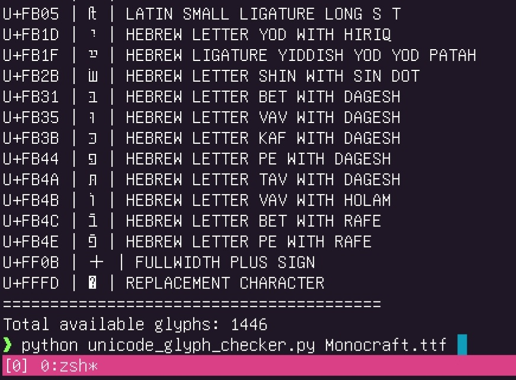

   

# Unicode Glyph Checker

This Python script allows you to check and display all available glyphs in a given font file. It provides information about each glyph, including its Unicode code point, character representation, and name.

## Features

- Loads and analyzes TrueType (.ttf) and OpenType (.otf) font files
- Displays a list of all available glyphs in the font
- Shows Unicode code point, character, and name for each glyph
- Provides a total count of available glyphs

## Requirements

- Python 3.6+
- fonttools library

## Installation

1. Clone this repository or download the unicode_glyph_checker.py file.

2. Install the required library:

`pip install fonttools`

## Usage

Run the script from the command line, providing the path to the font file as an argument:

`python unicode_glyph_checker.py <font_file_path>`

For example:

`python unicode_glyph_checker.py Monocraft.ttf`

## Output

The script will display a list of all available glyphs in the following format:

Available glyphs in the font Monocraft.ttf:
========================================
U+0020 |   | SPACE
U+0021 | ! | EXCLAMATION MARK
U+0022 | " | QUOTATION MARK
...
========================================
Total available glyphs: X

Where:
- U+XXXX is the Unicode code point
- The character between | symbols is the glyph itself
- The text after the second | is the Unicode name of the character

## Note

Some characters may not display correctly in your terminal if it doesn't support them or if you're using a font that doesn't include those glyphs.
